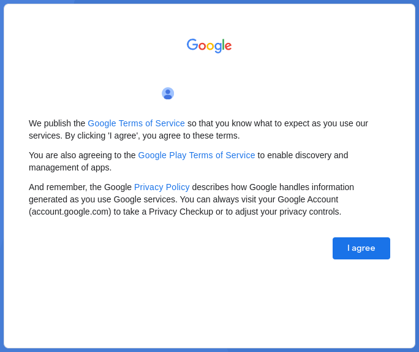
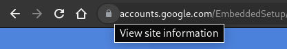

# Unofficial Java client library for Google Play Services OAuth
Simple library that can be used to get access some non-public Google APIs as an Android Device.

## Table of content
- [General info](#general-info)
  - [Receiving an authentication token](#receiving-an-authentication-token)
  - [Types of tokens](#types-of-tokens)
- [Download](#download)
- [Simple example](#simple-example)
- [Report Issues](#report-issues)
- [Contributing](#contributing)
- [License](#license)

## General info

### Receiving an authentication token
To get a master token, firstly you need to receive an authentication token.

Follow these steps to take it:
1. Go [here](https://accounts.google.com/EmbeddedSetup), log in with a Google account and agree to the terms \
\


2. Find the `lock` \
\


3. Go to the `Cookie` section \
\


4. Expand the `accounts.google.com` dropdown menu \
\


5. Find the `oauth_token` inside the `Cookie` menu and copy a token from the `Content` field \
\


### Types of tokens

- Authentication token (starts with `oauth2_4/`) *expires quickly, can be used only once*
- Master token (starts with `aas_et/`) *never expires*
- Access token (starts with `ya29.`) *expires in 1 hour*

## Download
### *Available [here](https://mvnrepository.com/artifact/io.github.rukins/gpsoauth)*
#### Maven
```xml
<dependency>
    <groupId>io.github.rukins</groupId>
    <artifactId>gpsoauth</artifactId>
</dependency>
```
#### Gradle
```groovy
implementation group: 'io.github.rukins', name: 'gpsoauth'
```
#### Gradle (Kotlin)
```kotlin
implementation("io.github.rukins:gpsoauth")
```

## Simple example

```java
import io.github.rukins.gpsoauth.Auth;
import io.github.rukins.gpsoauth.exception.AuthError;
import io.github.rukins.gpsoauth.model.MasterToken;
import io.github.rukins.gpsoauth.model.MasterTokenRequestParams;

public class Main {
  public static void main(String[] args) {
    Auth auth = new Auth();

    MasterTokenRequestParams masterTokenRequestParams = MasterTokenRequestParams
            .withDefaultValues()
            .token("oauth2_4/***")
            .build();

    MasterToken masterToken;
    try {
      masterToken = auth.getMasterToken(masterTokenRequestParams);
    } catch (AuthError e) {
      System.out.println(e.getErrorObject());

      return;
    }

    AccessTokenRequestParams accessTokenRequestParams = AccessTokenRequestParams
            .withDefaultValues()
            .masterToken(masterToken.getMasterToken())
            .app("com.google.android.keep")
            .scopes("oauth2:https://www.googleapis.com/auth/memento https://www.googleapis.com/auth/reminders")
            .build();

    AccessToken accessToken;
    try {
      accessToken = auth.getAccessToken(accessTokenRequestParams);
    } catch (AuthError e) {
      System.out.println(e.getErrorObject());

      return;
    }

    System.out.println(masterToken.getMasterToken());
    System.out.println(accessToken.getAccessToken());
  }
}
```

#### And for example, request notes with an access token:
```
curl -i -X GET -H "Authorization: OAuth ya29.***" "https://www.googleapis.com/notes/v1/changes"
```

## Report Issues
In the [Issues](https://github.com/rukins/gpsoauth/issues) section you can suggest any improvements and report any bugs you find

## Contributing
This is an open-source project and all contributions are highly welcomed

## License

Released under [MIT License](LICENSE)